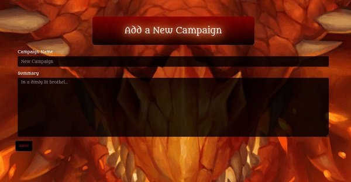

# Dungeon Master Manager
Dungeons and Dragons is a massively popular fantasy role playing game, where a dungeon master guides players on a quest, and the success and enjoyment of everyone is largely dependent on the person guiding the gameplay. That person is the Dungeon Master. Dungeon Masters set the scene, creating characters to help bring the world alive for the other players. 

This app is designed to allow users to manage non playable characters, and keep track of the worlds they've built. Users can sign up, log in, and create campaigns and characters. 

 

## Signing Up
When new users sign up, they are automatically assigned a new campaign called 'Character Sandbox.' If they chose to create a new character outside of a campaign, they can save their characters to this default campaign. 

## Creating a Campaign

When a user creates a new campaign, they need to enter a title and they can add a short description to keep track of any important details about the game. They can always come back and edit the information as the game unravels. 

## Creating a Character

When a user creates a new character, they are given certain traits to decide, such as class, race, subclass, and subrace. These options are populated by the Dungeons and Dragons 5th edition API. The user also selects a campaign to add the character into, either their Character Sandbox or a new campaign they have created. 

## View Campaigns

When a user wants to View Campaigns, they click the link and there they can see all their campaigns, update a certain campaign, or even delete an old campaign. 

## View Characters

Just like View Campaigns, View Characters is where the user can see all their npcs, and decide to update or delete any character. 

### Future Developements

Our team would like to in the future incorporate more information to assist users in playing DnD. 

We would also like to add furthur functionality to assist players in connecting, and playing DnD online. 

### Technology

This app was created with the following. 

- HTML 5
- CSS 3
- JavaScript
- Node.js
- MySQL
- Sequelize
- Heroku
- Multiple.js
- Bootstrap

Please visit our app on [Heroku](https://serene-lowlands-40117.herokuapp.com/). 

